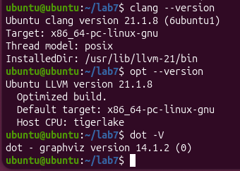
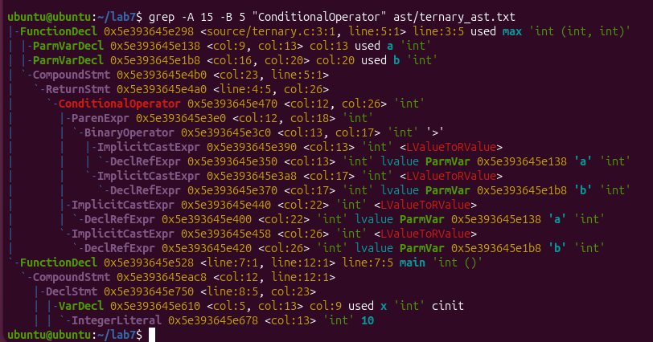
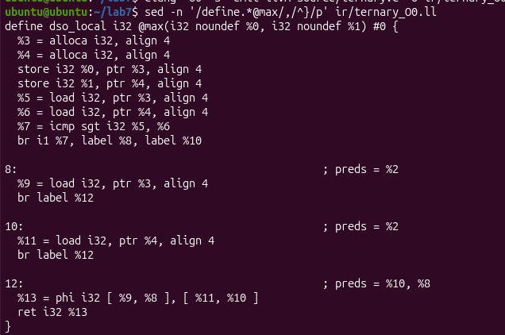
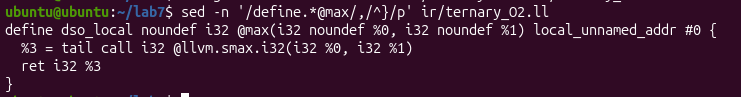
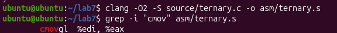
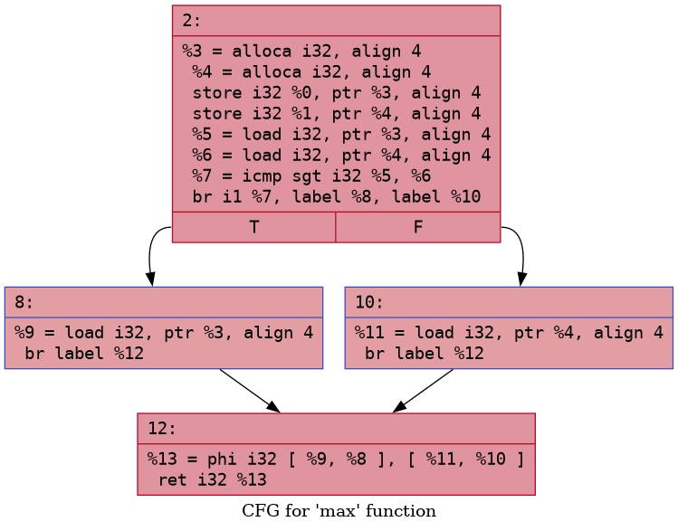
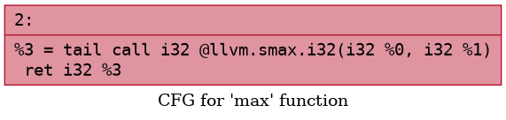
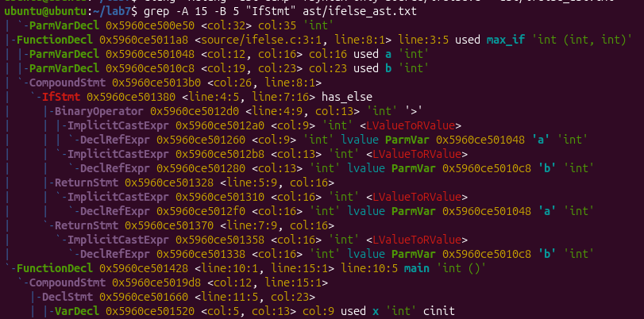

# Лабораторная работа №7 - Преобразование и анализ кода с использованием Clang и LLVM
## Цель работы
Познакомиться с инструментами Clang и LLVM, научиться собирать AST и IR-промежуточное представление кода на C/C++, а также извлекать базовую информацию о программе (например, список функций).
## Автор
* Сущих Анна
* Группа: АП-326
## Постановка задачи
Необходимо установить Clang, LLVM, opt и Graphviz, получить AST и LLVM IR для C-файла, применить оптимизацию -O2, построить CFG, сравнить результаты до и после оптимизации. 

Индивидуальное задание: 2.14 Тернарный оператор. 

Необходимо:
* Сравнить AST и IR тернарного оператора с if-else.
* Применить -O2 и проверить, получается ли cmov.
* Построить CFG и сравнить с if-else.
* Сделать вывод о различиях тернарного оператора и условных переходов в IR.
## Установка и подготовка среды
Работа выполнялась в Ubuntu 26.04 LTS через Oracle VirtualBox на Windows.

Установка инструментов:
```
sudo apt update
sudo apt install clang llvm graphviz
```
Проверка версий:
```
clang --version
opt --version
dot -V
```


Рисунок 1 — Проверка установленных инструментов: Clang, LLVM/opt и Graphviz.
## Исходный код
Файл ternary.c:
```
#include <stdio.h>

int max(int a, int b) {
    return (a > b) ? a : b;
}

int main() {
    int x = 10, y = 20;
    int m = max(x, y);
    printf("Max: %d\n", m);
    return 0;
}
```
## Получение AST
Команда:
```
clang -Xclang -ast-dump -fsyntax-only source/ternary.c > ast/ternary_ast.txt
grep -A 15 -B 5 "ConditionalOperator" ast/ternary_ast.txt
```


Рисунок 2 - Фрагмент AST тернарного оператора: узел ConditionalOperator

В AST тернарный оператор представлен узлом ConditionalOperator. Условие (a > b) представлено как BinaryOperator '>', а ветви результата — как обращения к параметрам a и b
## Генерация LLVM IR без оптимизаций
Команды:
```
clang -O0 -S -emit-llvm source/ternary.c -o ir/ternary_O0.ll
sed -n '/define.*@max/,/^}/p' ir/ternary_O0.ll
```


Рисунок 3 — LLVM IR тернарного оператора без оптимизаций (-O0)

В IR без оптимизаций тернарный оператор представлен через условное ветвление. Сначала выполняется сравнение icmp sgt, затем инструкция br передаёт управление в одну из двух ветвей. После этого результат объединяется с помощью phi-узла.
## Генерация LLVM IR после оптимизации -O2
Команды:
```
clang -O2 -S -emit-llvm source/ternary.c -o ir/ternary_O2.ll
sed -n '/define.*@max/,/^}/p' ir/ternary_O2.ll
```


Рисунок 4 — LLVM IR тернарного оператора после оптимизации -O2.

После оптимизации -O2 LLVM распознал выражение (a > b) ? a : b как вычисление максимума двух знаковых целых чисел и заменил ветвление на intrinsic llvm.smax.i32.
## Проверка cmov
Команды:
```
clang -O2 -S source/ternary.c -o asm/ternary.s
grep -i "cmov" asm/ternary.s
```


Рисунок 5 — Проверка наличия инструкции cmovgl в ассемблерном коде.

В ассемблерном коде была получена инструкция cmovgl. Это означает, что простой выбор значения по условию был реализован через условное перемещение, а не через обычный условный переход.
## Построение CFG
Команды:
```
opt -passes=dot-cfg -disable-output ir/ternary_O0.ll
dot -Tpng "$file" -o "${file%.dot}.png"

opt -passes=dot-cfg -disable-output ir/ternary_O2.ll
dot -Tpng "$file" -o "${file%.dot}_O2.png"
```
CFG без оптимизаций:



Рисунок 6 — CFG функции max без оптимизаций (-O0)

CFG после -O2:



Рисунок 7 — CFG функции max после оптимизации -O2

При -O0 CFG содержит блок условия, две ветви и общий блок с phi-узлом. После -O2 CFG упрощается до одного базового блока с вызовом llvm.smax.i32.
## Сравнение с if-else
Для сравнения был создан файл ifelse.c:
```
#include <stdio.h>

int max_if(int a, int b) {
    if (a > b)
        return a;
    else
        return b;
}

int main() {
    int x = 10, y = 20;
    int m = max_if(x, y);
    printf("Max: %d\n", m);
    return 0;
}
```
Команда для AST:
```
clang -Xclang -ast-dump -fsyntax-only source/ifelse.c > ast/ifelse_ast.txt
grep -A 15 -B 5 "IfStmt" ast/ifelse_ast.txt
```


Рисунок 8 — Фрагмент AST конструкции if-else: узел IfStmt.

В AST конструкция if-else представлена узлом IfStmt с признаком has_else. В отличие от неё, тернарный оператор представлен узлом ConditionalOperator.

При сравнении IR видно, что при -O0 обе конструкции используют условное ветвление. Однако тернарный оператор объединяет результат через phi, а if-else использует временную переменную, в которую записывается результат из каждой ветви.

После -O2 различия исчезают: и тернарный оператор, и if-else преобразуются к llvm.smax.i32.
## Вывод о различиях тернарного оператора и условных переходов в IR
На уровне исходного кода тернарный оператор и if-else являются разными синтаксическими конструкциями. В AST это видно напрямую: тернарный оператор представлен как ConditionalOperator, а if-else — как IfStmt.

На уровне LLVM IR без оптимизаций тернарный оператор уже не существует как отдельная высокоуровневая конструкция языка C. Он преобразуется в набор низкоуровневых инструкций: сравнение icmp, условный переход br, две ветви выполнения и объединение результата через phi.

Условный оператор if-else в IR также преобразуется в условный переход br и несколько базовых блоков. Отличие в полученном IR состоит в том, что тернарный оператор возвращает значение выражения через phi, а if-else записывает результат во временную переменную через store, затем загружает его через load.

После применения -O2 различия практически исчезают. LLVM распознаёт обе конструкции как вычисление максимума двух знаковых целых чисел и заменяет их на intrinsic llvm.smax.i32. При генерации ассемблерного кода используется cmovgl, то есть условное перемещение без обычного перехода.

Таким образом, тернарный оператор в IR не является отдельной инструкцией. Без оптимизаций он превращается в условное ветвление, а после оптимизаций может быть сведён к более компактной форме без явных переходов.
## Общие выводы
В ходе работы были установлены Clang, LLVM, opt и Graphviz. С помощью Clang был получен AST и LLVM IR для программы на C. С помощью opt и Graphviz были построены CFG до и после оптимизации.

Оптимизация -O2 значительно упрощает IR: удаляются лишние обращения к памяти, исчезают условные переходы, а простые шаблоны выражений заменяются на компактные intrinsic-инструкции LLVM.

Работа показала, что LLVM IR удобен для анализа и оптимизации программы, потому что разные синтаксические конструкции языка C могут быть приведены к единой промежуточной форме.
## Ответы на контрольные вопросы
## 1. Что такое Clang, и какова его роль в процессе компиляции программ?
Clang — это компилятор языков C, C++ и Objective-C. Он выполняет анализ исходного кода, строит AST, проверяет корректность программы и может генерировать LLVM IR.

## 2. Что представляет собой LLVM и как он используется в современных компиляторах?
LLVM — это инфраструктура для создания компиляторов. Она предоставляет промежуточное представление LLVM IR, набор оптимизаций и средства генерации машинного кода для разных архитектур.

## 3. Чем отличается AST от промежуточного представления LLVM IR?
AST близко к исходному тексту программы и отражает синтаксическую структуру языка. LLVM IR ниже уровнем: он описывает операции, переходы, загрузки, сохранения и вызовы функций в форме, удобной для анализа и оптимизации.

## 4. Для чего необходимо промежуточное представление IR в процессе компиляции?
IR нужно, чтобы отделить фронтенд компилятора от оптимизаций и генерации машинного кода. Благодаря IR одни и те же оптимизации можно применять к программам, написанным на разных языках.

## 5. Что делает инструкция alloca в LLVM IR, и зачем она используется в функциях?
alloca выделяет память в стековом кадре функции. На -O0 она часто используется для локальных переменных и параметров, чтобы сохранить структуру программы близкой к исходному коду.

## 6. Зачем нужна оптимизация кода в компиляторе, и какие основные цели она преследует?
Оптимизация нужна для ускорения программы, уменьшения количества инструкций, сокращения обращений к памяти, удаления мёртвого кода и упрощения потока управления.

## 7. Что такое SSA-форма и почему она важна при оптимизации программ?
SSA — это форма, в которой каждое значение присваивается только один раз. Она облегчает анализ зависимостей между значениями и делает многие оптимизации проще и эффективнее.

## 8. Что такое граф потока управления CFG и как он помогает анализировать поведение программы?
CFG — это граф, вершинами которого являются базовые блоки, а рёбрами — возможные переходы между ними. Он помогает анализировать ветвления, циклы и порядок выполнения программы.

## 9. Как устроено представление арифметических операций в LLVM IR?
Арифметические операции представлены отдельными инструкциями, например add, sub, mul, sdiv. Сравнения представлены инструкциями вроде icmp.

## 10. Почему функции в LLVM IR обычно представляют собой отдельные единицы анализа и оптимизации?
Функция имеет собственные параметры, локальные переменные, базовые блоки и CFG. Поэтому её удобно анализировать и оптимизировать отдельно.

## 11. Что происходит с функцией в LLVM IR, если она вызывается один раз и очень короткая?
Оптимизатор может встроить такую функцию в место вызова. Это называется inlining. После встраивания могут дополнительно примениться свёртка констант, удаление лишних инструкций и упрощение CFG.

## 12. Какие преимущества даёт использование IR и CFG для автоматических оптимизаций по сравнению с анализом исходного текста на C?
IR и CFG имеют более простую и формальную структуру, чем исходный код. Они не зависят напрямую от синтаксиса C, поэтому оптимизатору легче находить лишние операции, упрощать ветвления, анализировать зависимости и преобразовывать код.
